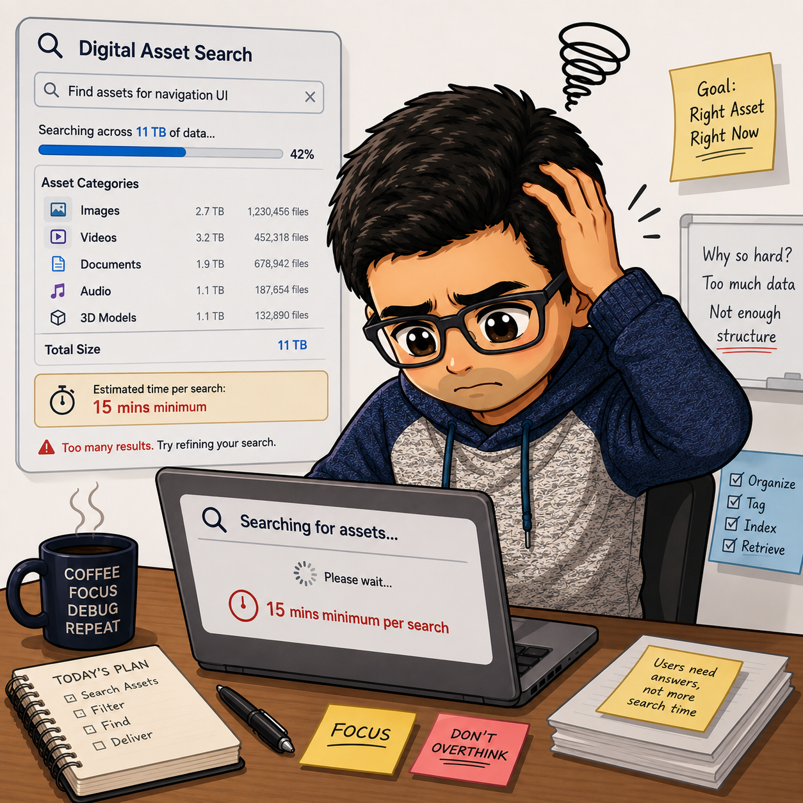
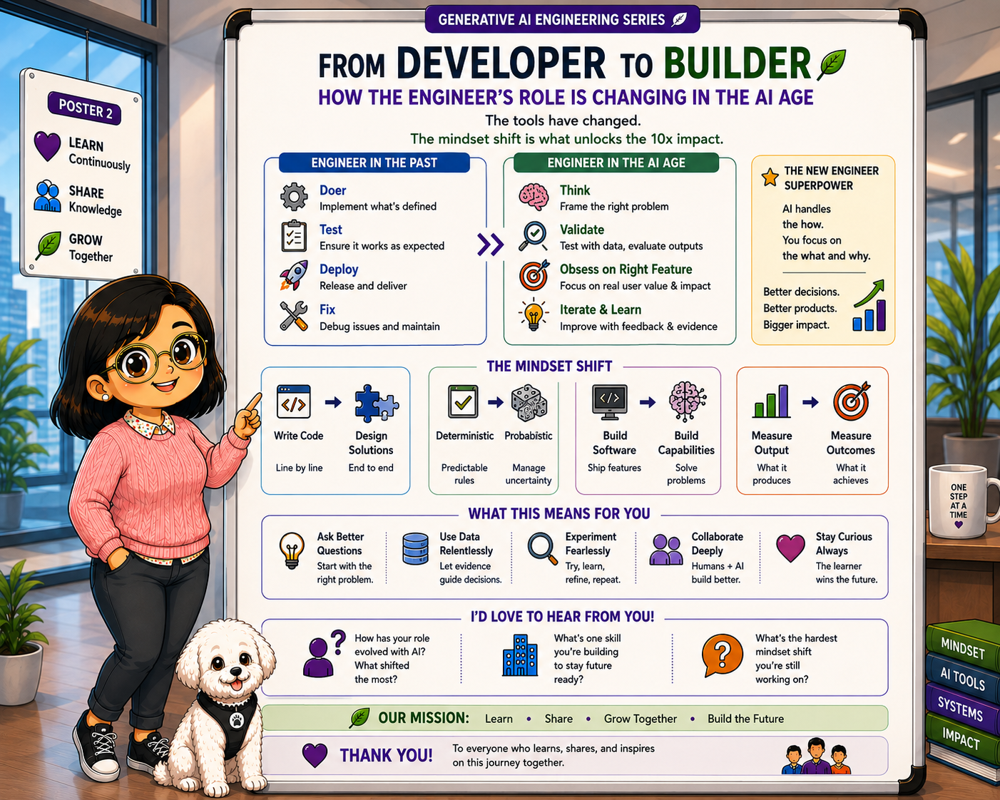
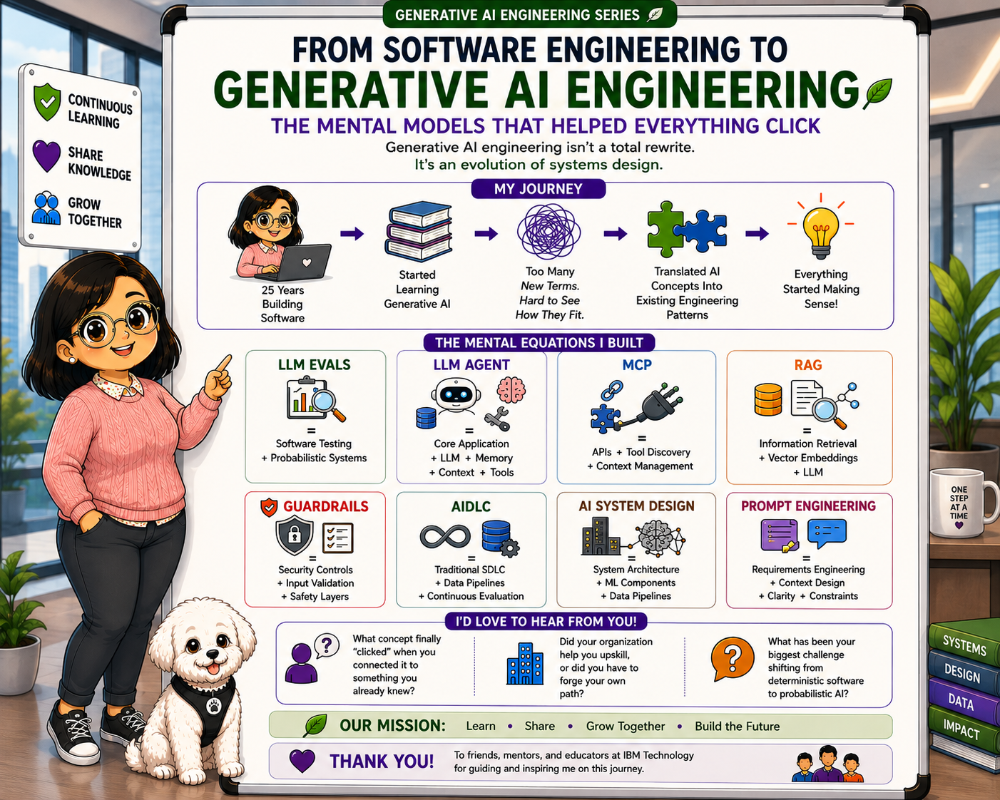
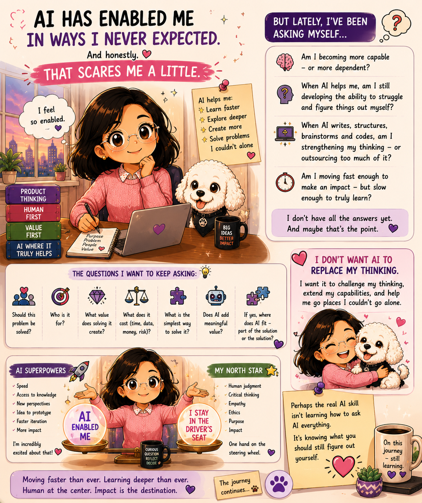

# Project Gallery

This repository contains the visual assets and diagrams tracking our development progress and AI initiatives.

## Available Media Assets

| Preview | File Name | Description |
| :---: | :--- | :--- |
|  | `CodeBasicAIPMRide.png` | AI PM Ride analysis/visualization. |
|  | `DhavalBhaiSearching.png` | Search flow or asset placeholder. |
|  | `SWDeveloper_to_Builder.png` | Developer to builder transition roadmap. |
|  | `SWE_to_AppliedGenerativeAI.png` | Applied Generative AI learning path. |
|  | `UshaAIEnablement.png` | AI Enablement documentation graphic. |
|  | `UshaSnowChibi.png` | Chibi avatar/character illustration. |
